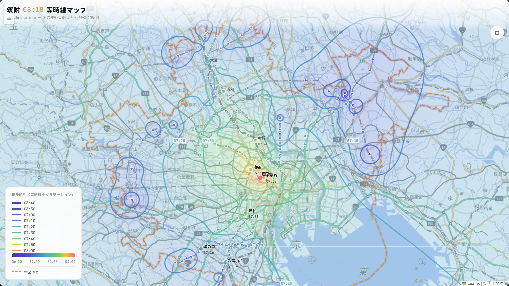

# 筑附中 08:10 等時線マップ

筑波大学附属中学校の朝の連絡（08:10）に間に合うための最遅出発時刻を、等時線（isochrone）マップとして可視化するWebアプリケーション。

🌎 **[ページはこちら](https://tsukuba-denden.github.io/isochrone-map/)**




## 主な機能

- **等時線表示**: 3分 / 5分 / 10分などの間隔で切り替え可能な出発時刻の等時線を地図上に描画。
- **グラデーション表示**: 出発時刻に応じた色分け（ヒートマップ形式）で視覚的にわかりやすく表示。
- **表示切替**:
  - 地図タイルの変更（国土地理院 淡色・標準・ダークタイルのほか、OpenStreetMap など）
  - 学区境界の表示/非表示（境界内外の判別）
  - 駅名ラベルの表示/非表示
  - ダークモードへの切り替え

## 技術スタック

- **フロントエンド**: HTML5, CSS3, Vanilla JavaScript
- **主要ライブラリ**: [Leaflet.js](https://leafletjs.com/) (地図描画)
- **データ更新スクリプト**: Python (`update.py`, `scripts/gen_gakku.py`)

## プロジェクト構成

```text
isochrone-map/
├── index.html        # エントリポイントとなるHTML
├── README.md         # 当ファイル
├── css/
│   └── style.css     # スタイルシート
├── data/
│   ├── gakku.geojson # 学区境界データ
│   └── stations.json # 駅ごとの出発時刻・経路データ
├── js/               # フロントエンドの各モジュール
│   ├── config.js
│   ├── data.js
│   ├── main.js
│   ├── map.js
│   ├── markers.js
│   ├── renderer.js
│   ├── ui.js
│   └── worker.js     # 描画処理などのWeb Worker
├── scripts/
│   └── gen_gakku.py  # 学区境界データ生成用スクリプト
└── update.py         # 駅データのパッチ/更新用スクリプト
```

## 開発・データ更新

### フロントエンド開発
本プロジェクトは静的ファイルのみで構成されているため、特別なビルド環境は不要です。VS CodeのLive Server拡張機能や、ローカルサーバを立ち上げるだけで開発・確認が可能です。

```sh
# python の簡易サーバーを立ち上げる場合
python -m http.server 8000
```

### スクリプトの実行（データ更新・保守）
**`update.py`**、**`scripts/gen_gakku.py`**などがありますが、これはAIが一時的な使用を目的として作ったものだと思われます。使うなら中身確認してください

## ライセンス / 免責事項

- 本アプリはあくまで個人開発でコーディングエージェントを使ってささっと作っただけのプロジェクトです。表示される乗り換え時間や出発時刻は丹精込めてYahooマップにて入力で調べましたが、とはいえ目安であるため、正確な到着時間を保証するものではありません。
- 利用している地図タイルや各種地理データは、各提供元（国土地理院、OpenStreetMap等）の利用規約に準じます。

